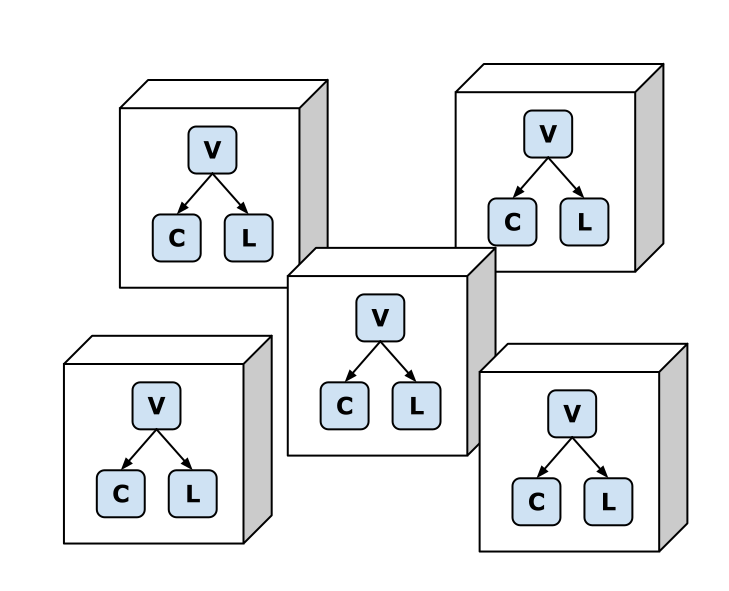
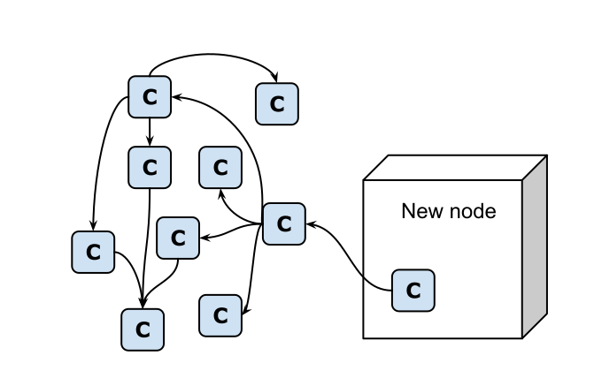
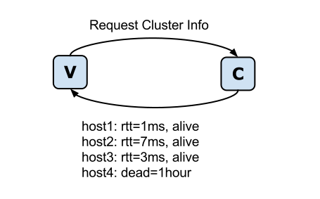
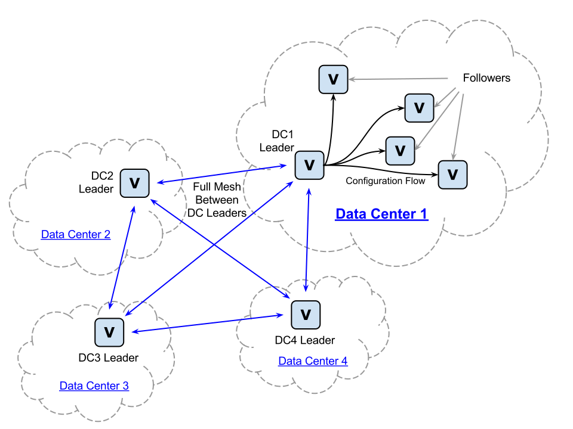

.. _concepts:

========
Concepts
========

Verwalter is a cluster orchestration tool

Briefly verwalter does the following:

* Starts configured set of services
* Monitors cluster load and changes number of workers on demand
* Does gradual software update of supervised services triggered by operator
* Provides limited form of service discovery
* All the features are scriptable by clean and simple Lua_ code fragments

It builds on top of lithos_ (which is isolation, containerization, and
supervising service) and cantal_ (which is sub-real-time monitoring and node
discovery service).

Verwalter is a framework for long-running services. It has abstractions to
configure running 10 instances of service X or use 7% of capacity for service
Y. The resources are consumed until configuration changed. Contrast this
approach with Mesos_ or Yarn_ which has "start task A until it completes"
abstraction. (However, Verwalter can run and scale Mesos or Yarn cluster).

Components
==========

Let's look through each component of the system first. This is very helpful
to understand the big picture outlined below.

Note the setup of the cluster is flat: you need all three components
``verwalter``, ``lithos`` and ``cantal`` on all nodes.

Lithos
------

Lithos_ is essentially a process supervisor. Here is the basic workflow:

1. Read configuration at ``/etc/lithos/sandboxes``
2. For each sandbox read configuration in ``/etc/lithos/processes``
3. Prepare the sandbox a/k/a linux container
4. Start process and keep restarting if that fails
5. Add/remove process if configuration changed

Lithos provides all necessary isolation for running processes (except it does
not handle network at the moment of writing), but it's super-simple
comparing to docker_ and mesos_ (i.e. mesos-slave) and even systemd_:

* Lithos reads configuration from files, no network calls needed (note the
  security impact)
* Lithos can restart itself in place, keeping track of processes, so it's
  mostly crash-proof
* On ``SIGHUP`` signal (configuration change) it just restarts itself

The **security model** of lithos_ is the ground for the security of whole
verwalter-based cluster. So let's take a look:

* It's expected that configs for ``sandboxes`` are predefined by
  administrators and are not dynamically changed (either by verwalter or any
  other tool)
* Sandbox config constrains folders, users, and few other things that
  an application can't escape
* The command-line to run in sandbox is defined in image for the application

All this means that verwalter can only change the following things:

* Image (i.e. version of image) to run command from
* The name of the command to run from limited set of options
* Number of processes to run

I.e. whatever evil would be in verwalter's script it can't run an arbitrary
command line on any host. So can't install a rootkit, steal users' passwords
and do any other harm except taking down the cluster (which is an expected
permission for resource scheduler). This is in contrast to docker_/swarm and
mesos_ that allow to run anything.

Cantal
------

The cantal_ is a semi-real-time monitoring tool. It delivers statistics in
unusually short intervals and provides *node* discovery.

We use it:

* As a node discovery and availability monitoring
* For looking at current metrics of started application in nearly real-time
* As a liveness check for applications (mostly by looking at metrics)
* For collecting metrics from all nodes and aggregating
* For fetching limited amount of historical data (~1 hour)

Verwalter
---------

The verwalter is final piece of the puzzle to build fully working and
auto-rebalancing cluster.

In particular it does the following:

1. Establishes leader of the cluster (or a subcluster in case of split-brain)
2. Leader runs model of the cluster defined by sysadmin and augmented with lua
   scripts, to get a number of processes run at each machine (and other
   important pieces of configuration).
3. Leader delivers configuration to every other node
4. At every node, the configuration is rendered to local configuration files
   (most importantly ``/etc/lithos/processes``, but other types of
   configuration are supported too), and respective processes are notified.
5. All nodes display web frontend to review configuration. Frontend also has
   actionable buttons for common maintainance tasks like software upgrade or
   remove node from a cluster

Unlike popular combinations of etcd_ + confd_, consul_ + consul-template_, or
mesos_ with whatever framework, verwalter can do scheduling decisions in
split-brain scenario even in minority partition. Verwalter is not a database so
having two leaders is not a problem when used wisely.

.. note:: Yes you can control how small cluster must be for cluster model to
   work, and you can configure different reactions in majority and minority
   partition. I.e. doing any decisions on a single node isolated from 1000
   other nodes is useless. But switching off external `memcache` instance
   for the sake of running local one may be super-useful if you have a
   micro-service running on just two nodes.

The Missing Parts
-----------------

In the current implementation, the missing part of the puzzle is a means to
deliver files to each box. In particular the following files might need to be
distributed between nodes:

1. Images of containers for lithos
2. Vervalter's configs and configuration templates

We use ansible_ and good old rsync_ for these things for now

The Big Picture
===============

   All three processes [C]antal,
   [L]ithos and [V]erwalter on every machine

The cluster setup is simple. We have only one type of node and that node
runs three lightweight processes: lithos_, cantal_ and verwalter.

As outlined above cantal_ does node discovery by UDP. When the node first time
becomes up, it needs to join the cluster. Joining the cluster is done
by issuing a request::

    curl http://some.known.host:22682/add_host.json -d '{"addr": "1.2.3.4:22682"}'

.. warning:: This is not a stable API, so it may change at any time.

   Propagation of cluster join message

As the nodes are all equal you can issue a request to any node, or you can add
any existing node of a cluster to the new node, it doesn't matter. All the
info will quickly propagate to other nodes via gossip protocol.

As illustrated on the picture the discovery is random. But it tuned well to
efficiently cover the whole network.

   Initial request of cluster info

When starting up, verwalter requests cluster information **from local cantal
instance**. The information consists of:

* list of peers in the cluster
* availability of the nodes (i.e. time of last successful ping)
* some minor useful info like round trip time (RTT) between nodes

Verwalter delegates all the work of joining cluster to cantal.

As described above, verwalter operates in one of the two modes: leader and
follower. It starts as follower and waits until it will be reached by a leader.
The Leader in turn discovers followers through cantal. I.e. it assumes that
every cantal that joins the cluster has a verwalter instance.

.. note::

    While cantal is joining cluster and verwalter does its own bootrapping
    and possible leader election, the lithos continues to run. The above means
    if there was any configuration for lithos before a reboot of the system or
    before you do any maintenance of the verwalter/consul, the processes are
    started and supervised. Any processes that crash are restarted and so on.

    In case you don't want processes to start on boot, you may configure the
    system to clean lithos configs on reboot (for example by putting them on
    ``tmpfs`` filesystem). Such configuration is occasionally useful, but we
    consider the default behaviour to start all processes that were previously
    run more useful in most cases.

Leader's Job
------------

When verwalter follower is not reached by a leader for the predefined time (don't
matter whether it is on startup or after it had a leader), it starts an election
process. The election process is not described in detail here because it's work
in progress. It will be described in detail later in other parts of
documentation.

When verwalter elected as a leader:

1. It connects to every node and ensures that every follower knows the leader
2. After establishing connections, it gathers the configuration of all
   currently running processes on every node
3. It connects to local cantal and requests statistics for all the nodes
4. Then it runs scheduling algorithm that produces new configuration for every
   node
5. At next step it delivers configuration to respective nodes
6. Repeat from step 3 at regular intervals (~10 sec)

In fact, steps 1-3 are done simultaneously. As outlined in
`cantal documentation`_ it gathers and aggregates metrics by itself, easing
the work for verwalter.

Note that at the moment when a new leader is elected the previous one is probably
not accessible (or there were two of them, so no shared consistent configuration
exists). So it is important to gather all current node configurations to keep
number of reallocations/movements of processes between machines at a minimum. It
also allows to have persistent processes (i.e. processes that store data on the
local filesystem or in local memory, for example, database shards).

Having not only old configuration but also statistics is crucial, we can
use it for the following things:

1. Detect failing processes
2. Find out the number of requests that are processed per second
3. Predict trends, i.e. whether traffic is going up or down

All this info is gathered continuously and asynchronously. Nodes come and leave
at every occasion, so it is too complex to reason about them in a reactive
manner. So from SysOp's point of view  the scheduler is a pure function from a
{*set of currently running processes*; *set of metrics*} to the new
configuration. The verwalter itself does all heavy lifting of keeping all nodes
in contact, synchronizing changes, etc.

The input to the function in simplified human-readable form looks like the
following::

    box1 django: 3 running, 10 requests per second and growing; 80% CPU usage
    box2 flask: 1 running, 7 RPS and declining; django: 2 starting; 20 %CPU

In lua code function looks like this (simplified):

.. code-block:: lua

    function scheduler (processes, metrics)
        ...
        return config
    end

Furthermore, we have helper utilities to actually keep matching processes
running. So in many simple cases scheduler may just return the number of
processes it wants to run or keep running. In simplified form it looks like
this:

.. code-block:: lua

    function schedule_simple(metrics)
        cfg = {
            django_workers = metrics.django.rps / DJANGO_WORKER_CAPACITY,
            flask_workers = metrics.flask.rps / FLASK_WORKER_CAPACITY,
        }
        total = cfg.django_workers + cfg.flask_workers
        if total > MAX_WORKERS then
            -- not enough capacity, but do our best
            cfg = distribute_fairly(cfg)
        else
            -- have some spare capacity for background tasks
            cfg.background_workers = MAX_WORKERS - total
        end
        return cfg
    end

    make_scheduler(schedule_simple, {
        worker_grow_rate: '5 processes per second',  -- start processes quickly
        worker_decline_rate: '1 process per second', -- but stop at slower rate
    })

Of course the example is oversimplified, it is only here to get some spirit of
what scheduling might look like.

By using proper lua sandbox, we ensure that function is *pure* (have no side
effects), so if you need some external data, it must be provided to cantal or
verwalter by implementing their API. In lua script, we do our best to ensure
that function is idempotent, so we can log all the data and resulting
configuration for **post mortem debugging**.

Also this allows us to make "shadow" schedulers. I. e. ones that have no real
scheduling abilities, but are run on every occasion. The feature might be
useful to evaluate new scheduling algorithm before putting one in production.

.. _`cantal documentation`: http://cantal.readthedocs.org/en/latest/concepts.html#aggregated-metrics

Follower's Job
--------------

The follower is much simpler. When leadership is established, it receives
configuration updates from the leader. Configuration may consist of:

1. Application name and number of processes to run
2. Host name to IP address mapping to provide for an application
3. Arbitrary key-value pairs that are needed for configuring application
4. (Parts of) configurations of other nodes

Note the items (1), (4) and partially (3) do provide the **limited form of
service discovery** that was declared at start of this guide. The (2) is there
mostly for legacy applications which does not support service discovery. The
(4) is mostly for proxy servers that need a list of backends, instead of having
backends discover them by host name.

.. note:: We use extremely ignorant description of "legacy" here. Because even
   in 2015 most services don't support service discovery out of the box and
   most proxies have a list of backends in the config. I mean not just old
   services that are still widely used. But also services that are created in
   recent years. Which is problem on it's own but not the one verwalter is
   aimed to solve. It's just designed to work both with good and old-style
   services.

Every configuration update is applied by verwalter locally. In the simplest
form it means:

1. Render textual templates into temporary file(s)
2. Run configuration checker for application
3. Atomically move configuration file or directory to the right place
4. Signal the application to reload configuration

For some applications it might be more complex. For lithos which is the most
common configuration target for verwalter it's just a matter of writing
YAML/JSON config to temporary location and calling ``lithos_switch`` utility.

.. note:: We're still evaluating whether it's good idea to support plugins for
   complicated configuration scenarios. Or whether the files are universal
   transport and you just want to implement daemon on it's own if you want some
   out of scope stuff. The common case might be making API calls instead of
   reloading configuration like you might need for docker or any cloud
   provider. Lua scripting at this stage is also an option being considered.

Cross Data Center
=================

    between leaders

   The cross data center connection scheme

When crossing data center things start to be more complicated. In
particular verwalter assumes:

1. Links between data centers are order of magnitude slower than inside
   (normal RTT between nodes inside datacenter is 1ms; whereas between DC even
   on the same continent 40ms is expected value and sometimes may be up to
   120-500 ms). In some cases traffic is expensive.
2. The connection between datacenters is less reliable and when it's down
   clients might be serviced by single data center too. It should be possible
   to configure partial degradation.
3. Each DC has some spare capacity on it's own. So moving resources between
   data centers might be more gradual.
4. There are few data centers (i.e. it's normal to have 100-1000 nodes,
   but almost nobody has more than a dozen of DCs).

So verwalter establishes a leader inside every datacenter. On the
cross-data-center boundary all verwalter leaders treated equally. They form
full mesh of connections. And when one of them experiences peak load it just
requests some resources from other.

Let's repeat that again: because verwalter is not a database, consistency is
not important here. I.e. if some resources are provided by DC1 for DC2 and for
some reason latter lost connectivity or has some other reason to not use
requested resources, we just release them on a timeout by looking at
appropriate metrics. So dialog between data center leaders translated to
the human language may look like the following:

All things here are scriptable. So your logic may only move background tasks
across data-centers or use cloud API's to request more virtual machines

.. note:: A quick note to last sentence. You can't access cloud API directly
   because of sandboxing. But you may produce a configuration for some
   imaginary *cloud provider management daemon* that includes bigger value in
   the setting *number of virtual machines to provision*.

.. _lithos: http://github.com/tailhook/lithos
.. _cantal: http://cantal.readthedocs.org
.. _lua: http://lua.org
.. _mesos: http://mesos.apache.org/
.. _yarn: http://hadoop.apache.org/docs/current/hadoop-yarn/hadoop-yarn-site/YARN.html
.. _docker: http://docker.com
.. _ansible: http://ansible.com
.. _rsync: https://en.wikipedia.org/wiki/Rsync
.. _systemd: http://www.freedesktop.org/wiki/Software/systemd/
.. _etcd: https://coreos.com/etcd/
.. _confd: http://www.confd.io/
.. _consul: https://www.consul.io/
.. _consul-template: https://github.com/hashicorp/consul-template
